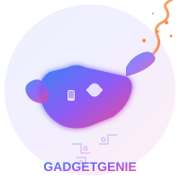

# 🛍️ Gadget Genie - Your Ultimate Tech Destination

<div align="center">
  
  <h3>Zimbabwe's Premier Tech E-commerce Platform</h3>
  
  [](https://reactjs.org/)
  [](https://www.typescriptlang.org/)
  [](https://tailwindcss.com/)
  [](https://supabase.com/)
</div>

## 🌟 Overview

Gadget Genie is a modern, full-featured e-commerce platform designed specifically for tech enthusiasts in Zimbabwe. Built with cutting-edge web technologies, it offers a seamless shopping experience for smartphones, electronics, and home appliances with competitive prices and fast nationwide delivery.

## ✨ Key Features

### 🛒 **Shopping Experience**
- **Responsive Design**: Optimized for desktop, tablet, and mobile devices
- **Advanced Product Catalog**: Browse smartphones, audio equipment, and electronics
- **Smart Search & Filtering**: Find products quickly with intelligent search
- **Shopping Cart**: Add, remove, and manage items with real-time updates
- **Wishlist**: Save favorite items for later purchase
- **Flash Sales**: Limited-time offers with countdown timers

### 👥 **User Management**
- **Secure Authentication**: Email/password login with Supabase Auth
- **User Profiles**: Manage personal information and preferences
- **Order History**: Track current and past orders
- **Address Management**: Save multiple shipping addresses

### 🔧 **Admin Dashboard**
- **Product Management**: Add, edit, and delete products
- **Order Management**: Process and track customer orders
- **User Management**: View and manage customer accounts
- **Analytics**: Sales reports and performance metrics
- **Notifications**: System-wide notification management

### 🎨 **Modern UI/UX**
- **Gradient Designs**: Beautiful color schemes throughout
- **Smooth Animations**: Hover effects and transitions
- **Side Banners**: Promotional content and special offers
- **Floating Action Button**: Quick access to cart on mobile
- **Toast Notifications**: User-friendly feedback system

## 🚀 Technology Stack

### **Frontend**
- **React 18.3.1** - Modern UI library with hooks
- **TypeScript** - Type-safe JavaScript development
- **Vite** - Lightning-fast build tool and dev server
- **Tailwind CSS** - Utility-first CSS framework
- **shadcn/ui** - Beautiful, accessible component library
- **Lucide React** - Consistent icon system

### **Backend & Database**
- **Supabase** - Backend-as-a-Service platform
  - PostgreSQL database with Row Level Security (RLS)
  - Real-time subscriptions
  - File storage for product images
  - Edge functions for serverless computing

### **State Management & Data Fetching**
- **TanStack Query (React Query)** - Server state management
- **React Context** - Global state for auth and cart
- **React Router DOM** - Client-side routing

### **Additional Libraries**
- **React Hook Form** - Form handling and validation
- **Zod** - Schema validation
- **date-fns** - Date manipulation utilities
- **Recharts** - Chart and analytics visualization

## 📱 Pages & Routes

| Route | Description | Access Level |
|-------|-------------|--------------|
| `/` | Homepage with featured products | Public |
| `/auth` | Authentication hub | Public |
| `/login` | User login | Public |
| `/signup` | User registration | Public |
| `/categories` | Product categories | Public |
| `/deals` | Special offers and sales | Public |
| `/audio` | Audio equipment catalog | Public |
| `/phones` | Smartphone catalog | Public |
| `/dashboard` | User dashboard | Authenticated |
| `/admin` | Admin control panel | Admin only |
| `/checkout` | Order checkout process | Authenticated |
| `/order-success` | Order confirmation | Authenticated |
| `/wishlist` | Saved items | Authenticated |

## 🛠️ Installation & Setup

### Prerequisites
- Node.js 18+ and npm
- Supabase account
- Git

### Quick Start

1. **Clone the repository**
   ```bash
   git clone <your-repo-url>
   cd gadget-genie
   ```

2. **Install dependencies**
   ```bash
   npm install
   ```

3. **Environment Configuration**
   
   The project uses Supabase for backend services. The configuration is already set up with:
   - Project ID: `ktpxqjyfguxckdzlqwai`
   - Anon Key: Pre-configured for development

4. **Start development server**
   ```bash
   npm run dev
   ```

5. **Open in browser**
   Navigate to `http://localhost:8080`

### Build for Production

```bash
npm run build
```

## 📊 Database Schema

The application uses a PostgreSQL database with the following main tables:

- **products** - Product catalog with images and specifications
- **profiles** - User profile information
- **orders** - Customer order records
- **order_items** - Individual items within orders
- **cart_items** - Shopping cart contents
- **user_roles** - Role-based access control
- **notifications** - System notifications

All tables implement Row Level Security (RLS) for data protection.

## 🔐 Authentication & Security

- **Supabase Auth** - Secure user authentication
- **Row Level Security** - Database-level access control
- **Role-based Access** - Admin, moderator, and user roles
- **Protected Routes** - Authentication required for sensitive pages
- **CORS Configuration** - Secure API access

## 📈 Performance Features

- **Code Splitting** - Lazy loading for optimal performance
- **Image Optimization** - Responsive images with proper loading
- **Caching** - TanStack Query for efficient data caching
- **Tree Shaking** - Minimal bundle size with Vite
- **CSS Optimization** - Tailwind CSS purging for production

## 🎨 Design System

### Color Palette
- **Primary**: Blue to Purple gradients (`from-blue-500 to-purple-600`)
- **Secondary**: Various accent colors for different sections
- **Status Colors**: Green (success), Red (error), Yellow (warning)

### Typography
- **Font Family**: Inter (Google Fonts)
- **Weights**: 300, 400, 500, 600, 700, 800

### Components
- Consistent button styles with hover effects
- Card-based layouts with shadows and gradients
- Responsive grid systems
- Mobile-first design approach

## 🚀 Deployment

The application can be deployed on various platforms:

### Recommended Platforms
- **Vercel** - Automatic deployments from Git
- **Netlify** - Easy static site hosting

### Environment Variables
No additional environment variables needed for basic deployment as Supabase configuration is included.

## 🧪 Testing

The project includes:
- TypeScript type checking
- ESLint code quality checks
- Component testing structure ready

## 📄 License

This project is proprietary software developed by Tyga Sparta.

## 👨‍💻 Developer

**Tyga Sparta**
- Website: [tyga-sparta.com](https://tyga-sparta.com)
- Specializing in modern web applications and e-commerce solutions

## 🤝 Contributing

This is a proprietary project. For feature requests or bug reports, please contact the developer directly.

## 📞 Support

For technical support or business inquiries:
- Developer: Tyga Sparta
- Website: [tyga-sparta.com](https://tyga-sparta.com)

## 🗺️ Roadmap

### Upcoming Features
- [ ] Mobile app development
- [ ] Payment gateway integration (EcoCash, Visa, Mastercard)
- [ ] Advanced inventory management
- [ ] Multi-vendor marketplace
- [ ] AI-powered product recommendations
- [ ] Live chat support
- [ ] Social media integration
- [ ] Advanced analytics dashboard

### Recent Updates
- ✅ User authentication system
- ✅ Shopping cart functionality
- ✅ Admin dashboard
- ✅ Product management
- ✅ Order processing
- ✅ Responsive design
- ✅ Notification system

---

<div align="center">
  <p>Built with ❤️ by <a href="https://tyga-sparta.com">Tyga Sparta</a></p>
  <p><strong>Gadget Genie</strong> - Bringing the latest technology to Zimbabwe 🇿🇼</p>
</div>
